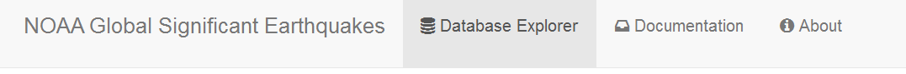
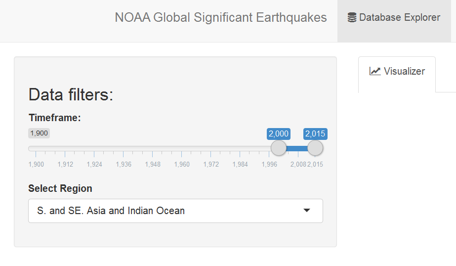
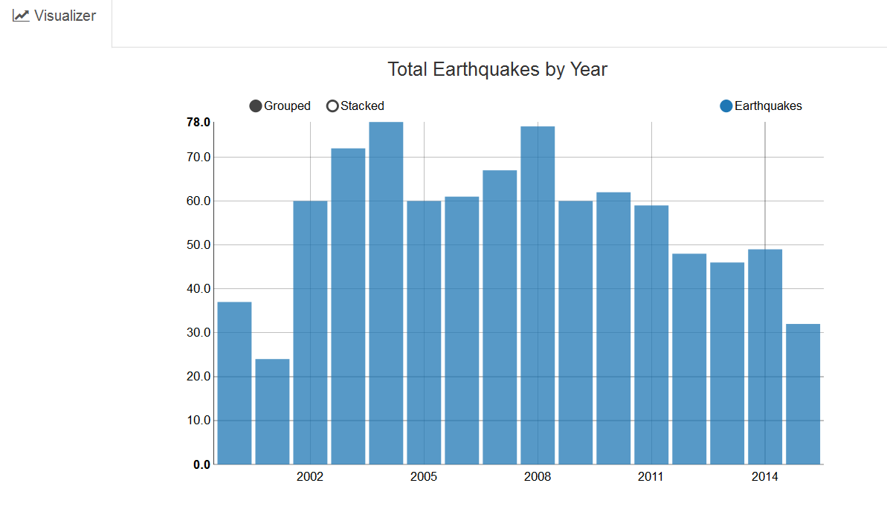

# Documentation
This application is part of the **Developing Data Products** course of the Data Science specialization on Coursera. It is a simple application that displays descriptive analytics about the **NOAA Global Significant Earthquakes** database.

The main menu of the app is divided into three main sections: **Database Explorer**, **Documentation** and, **About** as seen here in the main menu 

.

In this section you can find the main page of the app and additional information such as the documentation and general information about the app.

First things first, we need to select the range or "slice" of data that we want to explore. The easiest way to do this is by using the filters section on the left of the screen. Here we have two main filters: **Timeframe** and, **Region**. The Timeframe filter is a slicer that allows to dynamically select the range of year that you what to explore. The second filter is the region on which the Earthquakes occurred. Here is an illustration of them

Last but no least, on the Visualizer you can find three main dynamic charts that displays the **Total Earthquakes by Year**, **Total Earthquakes by Region**, and **Total Tsunamies by Region**.

I hope you this simple app and have fun!
